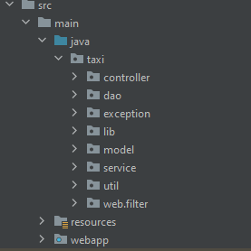
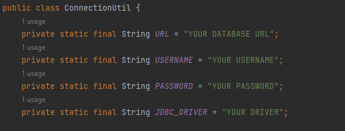

<h1 align="center">- - - - - 🚕TAXI-SERVICE🚕 - - - - -</h1>

# Arrive on time

``` python
    Now it is very important to be able to change your location quickly and comfortably. This need can be solved by taxi services.
But in order for these services to work productively, it is necessary to have a suitable and high-quality web service. 
A simple web application was developed in this project.
```
# Functionality of the service:
__You can do the following:__
 - Authenticate as a driver
 - Get a list of all drivers, cars and manufacturers
 - Register a new driver
 - Add a new car and manufacturer
 - Add a driver to the car
 - Get a list of your own cars
 - Log out of your account
# Project structure


__The project includes the following elements:__
- _controllers:_ Controllers for login/logout, displaying and adding drivers, cars and manufacturers
- _dao:_ Classes for accessing database tables
- _exceptions:_ There are custom exceptions
- _lib:_ Additional libraries are included here
- _model:_ Includes Driver, Manufacturer and Machine models
- _service:_ Provides multi-tiered architecture
- _util:_ Provides a connection to the database
- _web.filter:_ Includes existing filters


  __The webapp folder contains jsp pages__


# Business logic:
```python
    First, the user gets to the authentication page. 
There he must enter a login and password. Without authentication, the user can add a driver only. 
After logging in to the entire account, the user can view lists of all drivers, cars and manufacturers. 
It is possible to add these items to the database, and it is also possible to add a driver to a specific car and get
a list of the authorized driver's cars. 
Also user can return to the main menu and logout.
```
# Technologies:
- Servlets
- JavaServer Pages (JSP)
- Java Database Connectivity (JDBC)
- MySQL 8.0.31
- Hypertext Transfer Protocol (HTTP)

# How to start a project
To run this application, you need to install the following software:
- __Tomcat 9.0.50__
- __MySQL 8.0.31__
- __Workbench 8.0__

Then you need to create the necessary tables.
This can be done by running the code from a file /main/resources/__init_db.sql__ in the __Workbench__ environment

The next step will be connecting the database to the project, for this you need to enter your data in the class /taxi/util/__ConnectionUtil__



Finally, you should select the appropriate Tomcat configuration and click __"Run"__ or use a combination __Shift + F10__

  

